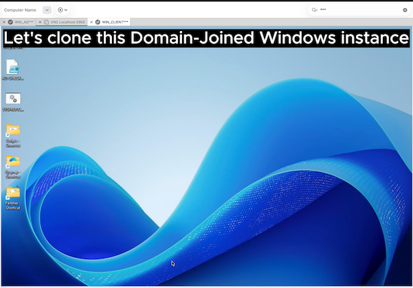

# OCI Runbook: Cloning Domain-Joined Windows instances

This document provides a standardized and validated procedure to perform **clone operations of Windows instances on OCI** while preserving **Active Directory integrity**.

Key objective:

- Ensure **data consistency**
- Avoid **domain trust failures**
- Enable **reliable disaster recovery**

***Read the following runbook and watch the video demonstration***

***[Watch the video](https://objectstorage.eu-frankfurt-1.oraclecloud.com/p/CbN7u5Q3MFBfdpz5uH4EaeJc8UW-XDnRRbi_BDGJzUK-m2AkjK5afEfMr_t0zf_x/n/olygo/b/github_cloning_windows/o/SYSPREP.mp4)***

)

## 1. Cloning Domain-Joined Windows instances

### 1.1 Prepare the source instance with Sysprep:

- Set a local Admin User and Password
- Clean folder c:\Windows\Panther\
- Create an unattend.xml file to automate Sysprep operations and post installation tasks
- Create a SetupComplete.cmd script to perform post installation tasks

### 1.2 Sysprep unattend.xml

This step is ***MANDATORY*** Without it, the instance will enter the OOBE (Out-of-Box Experience) at first boot, during which ***RDP is not enabled***.

As a result, you would need to connect via a VNC console to manually complete the setup process.

By using an [unattend.xml](./unattend.xml) file, the entire OOBE phase can be fully automated, allowing the instance to be ready for RDP access immediately after startup without any manual intervention.

This file must be copied in ***C:\Windows\System32\Sysprep\***

```
<?xml version="1.0" encoding="utf-8"?>
<unattend xmlns="urn:schemas-microsoft-com:unattend"
          xmlns:wcm="http://schemas.microsoft.com/WMIConfig/2002/State"
          xmlns:xsi="http://www.w3.org/2001/XMLSchema-instance">

  <!-- windowsPE -->
  <settings pass="windowsPE">
    <component name="Microsoft-Windows-International-Core-WinPE"
               processorArchitecture="amd64"
               publicKeyToken="31bf3856ad364e35"
               language="neutral"
               versionScope="nonSxS">
      <SetupUILanguage>
        <UILanguage>en-US</UILanguage>
      </SetupUILanguage>
      <InputLocale>en-US</InputLocale>
      <SystemLocale>en-US</SystemLocale>
      <UILanguage>en-US</UILanguage>
      <UserLocale>en-US</UserLocale>
    </component>
  </settings>

  <!-- specialize -->
  <settings pass="specialize">
    <component name="Microsoft-Windows-Shell-Setup"
               processorArchitecture="amd64"
               publicKeyToken="31bf3856ad364e35"
               language="neutral"
               versionScope="nonSxS">
      <ComputerName>*</ComputerName>
      <TimeZone>UTC</TimeZone>
    </component>
  </settings>

  <!-- oobeSystem -->
  <settings pass="oobeSystem">
    <component name="Microsoft-Windows-Shell-Setup"
               processorArchitecture="amd64"
               publicKeyToken="31bf3856ad364e35"
               language="neutral"
               versionScope="nonSxS">

      <!-- OOBE -->
      <OOBE>
        <HideEULAPage>true</HideEULAPage>
        <HideLocalAccountScreen>true</HideLocalAccountScreen>
        <HideOEMRegistrationScreen>true</HideOEMRegistrationScreen>
        <HideOnlineAccountScreens>true</HideOnlineAccountScreens>
        <HideWirelessSetupInOOBE>true</HideWirelessSetupInOOBE>
        <SkipMachineOOBE>true</SkipMachineOOBE>
        <SkipUserOOBE>true</SkipUserOOBE>
        <ProtectYourPC>3</ProtectYourPC>
      </OOBE>
    </component>
  </settings>
</unattend>
```

### 1.3 Sysprep unattend.xml

By using a [SetupComplete.cmd](./SetupComplete.cmd) script you can perform post installation tasks such as enabling RDP.

This file must be copied in ***C:\Windows\Setup\Scripts\***

```
@echo off
REM === Enable RDP ===
reg add "HKLM\SYSTEM\CurrentControlSet\Control\Terminal Server" /v fDenyTSConnections /t REG_DWORD /d 0 /f

REM === Disable NLA (optional but safer for first access) ===
reg add "HKLM\SYSTEM\CurrentControlSet\Control\Terminal Server\WinStations\RDP-Tcp" /v UserAuthentication /t REG_DWORD /d 0 /f

REM === Enable firewall rules for RDP ===
netsh advfirewall firewall set rule group="remote desktop" new enable=Yes

REM === Ensure Remote Desktop Services is running ===
sc config TermService start= auto
net start TermService

REM === Add user to Remote Desktop Users (just in case) ===
net localgroup "Remote Desktop Users" opc/add

REM === Log for debug ===
echo RDP enabled successfully > C:\rdp-setup.log
```

### 1.4 Run Sysprep

Open an administrator prompt: 

```
C:\Windows\System32\Sysprep\sysprep.exe /generalize /oobe /shutdown /unattend:C:\Windows\System32\Sysprep\unattend.xml
```

The instance shuts down automatically and is ready for cloning.

### 1.5 Clone instance

- Once Sysprep has stopped the Operating System, you must "Force Stop" the instance from OCI.
- Clone the boot volume of the instance or 
- Create a custom image

## 2. Post-cloning tasks:

- Launch a new instance from the boot volume clone or the custom image previously created.
- When instance starts: it boots in OOBE mode, the Operating System is then restarted several times.
- You must connect from a [VNC Console Connection](https://github.com/Olygo/OCI_Console-Connections) if you want to follow OOBE tasks 

***/!\ During initial setup (OOBE), the instance will be displayed as "RUNNING" in the OCI console, but the RDP protocol will not be enabled.***

- Once the instance is ready, you can connect using your ***Local Admin Account***

### 2.1 Add instance to your Active Directory domain

```powershell
Add-Computer -DomainName yourdomain.local -Credential yourdomain\admin -Restart
```

### 2.2 Validate Domain Trust

```powershell
Test-ComputerSecureChannel -Verbose
```

### 2.3 Checks the status of the secure channel that the NetLogon service established

```powershell
nltest /sc_verify:yourdomain.local` to check the trust relationship.
```

